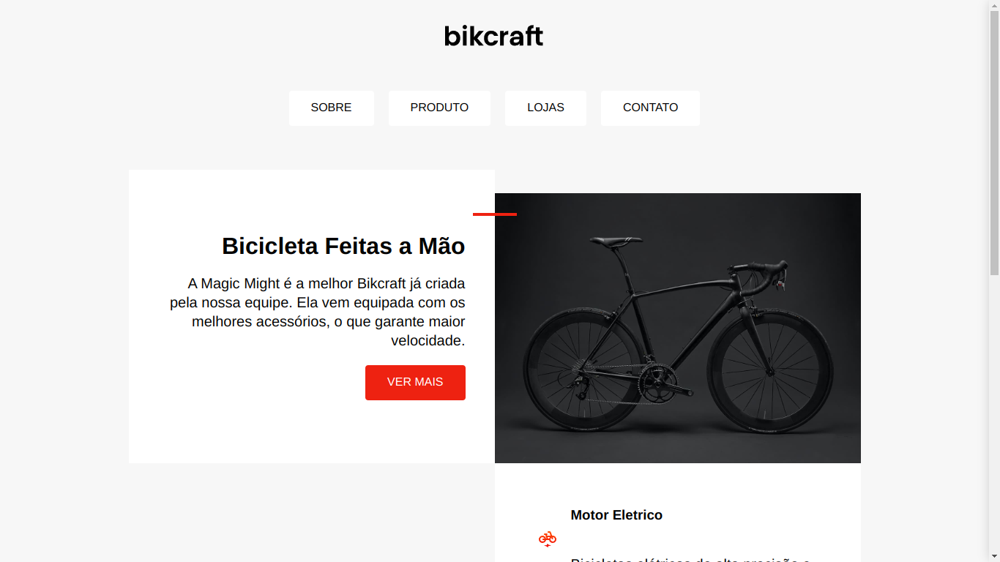

<h1 align="center">
  
</h1>

  <a href="#-technologies">Technologies</a>&nbsp;&nbsp;&nbsp;|&nbsp;&nbsp;&nbsp;
  <a href="#-project">Project</a>&nbsp;&nbsp;&nbsp;|&nbsp;&nbsp;&nbsp;

 

 

  

## 🚀 Technologies

This project was developed with the following technologies:

- HTML
- CSS

## 💻 Project

Bikcraft is a Hand Bicycle website

by Dominique Albuquerque - ORIGAMID
